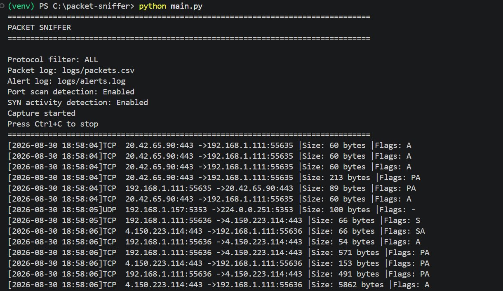
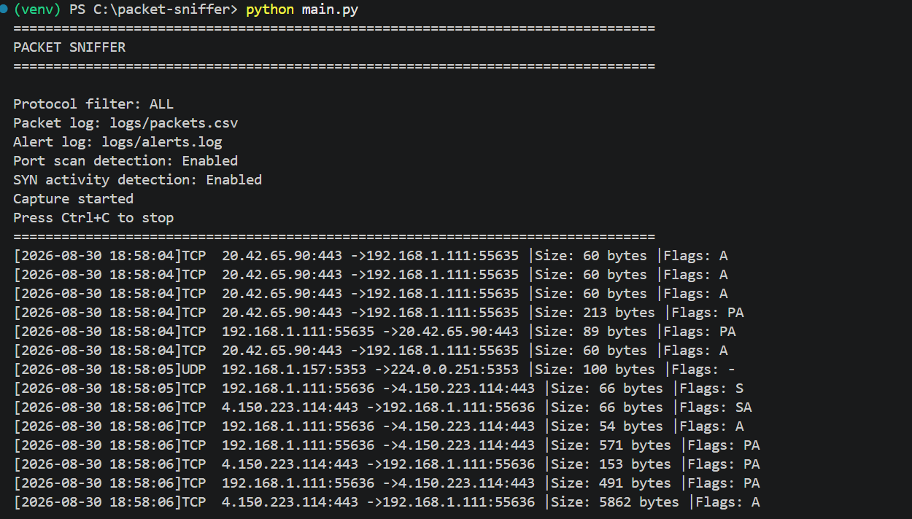

# Network Packet Sniffer & Traffic Analyzer

A Python-based network packet sniffer that captures and analyzes live network traffic using **Scapy**.

The tool can inspect TCP, UDP, and ICMP traffic, filter packets by protocol, log captured packet metadata, detect suspicious network patterns, and generate security alerts.

**Wireshark** can be used alongside the program to validate captured traffic.

> This project is intended for cybersecurity education, network monitoring, and authorized lab environments only.

---

## Features

- Live network packet capture
- TCP, UDP, and ICMP packet analysis
- Protocol-based filtering
- Source and destination IP extraction
- Source and destination port extraction
- TCP flag analysis
- Packet size monitoring
- Packet timestamps
- CSV packet logging
- Separate security alert logging
- Possible port scan detection
- High SYN activity detection
- Capture statistics
- Command-line arguments
- Wireshark validation

---

## Technologies Used

- **Python**
- **Scapy**
- **Wireshark**
- **Npcap** (Windows packet capture support)

---

## Project Structure

```text
packet-sniffer/
│
├── main.py
├── sniffer.py
├── detector.py
├── logger.py
├── config.py
├── requirements.txt
├── README.md
│
└── logs/
    ├── packets.csv
    └── alerts.log
```

### File Responsibilities

**main.py**

Entry point of the application. Handles command-line arguments and starts the packet sniffer.

**sniffer.py**

Captures live network traffic, parses packets, applies protocol filtering, and displays capture statistics.

**detector.py**

Contains the suspicious-traffic detection logic, including port scan and high SYN activity detection.

**logger.py**

Handles packet metadata logging and security alert logging.

**config.py**

Stores configuration values such as detection thresholds, time windows, and log file locations.

---

## Installation

### 1. Clone the Repository

```bash
git clone <your-repository-url>
cd packet-sniffer
```

Or download the project manually and open the folder in a terminal.

### 2. Create a Virtual Environment

```bash
python -m venv venv
```

On Windows PowerShell:

```powershell
.\venv\Scripts\Activate.ps1
```

If PowerShell blocks activation:

```powershell
Set-ExecutionPolicy -Scope Process -ExecutionPolicy Bypass
```

Then activate the environment again.

### 3. Install Dependencies

```bash
pip install -r requirements.txt
```

The Python dependency used by the project is:

```text
scapy
```

### 4. Install Wireshark and Npcap

On Windows, install **Wireshark** and make sure **Npcap** is installed during setup.

Npcap provides packet capture functionality required for live network sniffing on Windows.

---

## Usage

Depending on your operating system and configuration, the terminal may need to be run with Administrator/root privileges for packet capture.

### Capture All Supported Traffic

```bash
python main.py
```

The default protocol filter is:

```text
ALL
```

### Capture TCP Traffic

```bash
python main.py --protocol TCP
```

### Capture UDP Traffic

```bash
python main.py --protocol UDP
```

### Capture ICMP Traffic

```bash
python main.py --protocol ICMP
```

### View Available Options

```bash
python main.py --help
```

---

## Example Output

```text
================================================================================
PACKET SNIFFER
================================================================================
Protocol filter: TCP
Packet log: logs/packets.csv
Alert log: logs/alerts.log
Port scan detection: Enabled
SYN activity detection: Enabled
Capture started
Press Ctrl+C to stop
================================================================================

[2026-08-30 17:45:12] TCP   | 192.168.1.5:51432 -> 142.250.184.46:443 | 66 bytes | Flags: S
[2026-08-30 17:45:12] TCP   | 142.250.184.46:443 -> 192.168.1.5:51432 | 66 bytes | Flags: SA
```

Press:

```text
Ctrl+C
```

to stop the capture.

The program then displays capture statistics:

```text
================================================================================
CAPTURE STATISTICS
================================================================================
Total packets: 428
TCP packets:   311
UDP packets:   103
ICMP packets:  14
Other packets: 0
Alerts:        1
================================================================================
```

---

## Packet Logging

Captured packet metadata is stored in:

```text
logs/packets.csv
```

The CSV contains:

- Timestamp
- Protocol
- Source IP
- Source port
- Destination IP
- Destination port
- Packet size
- TCP flags

Example:

```csv
Timestamp,Protocol,Source IP,Source Port,Destination IP,Destination Port,Packet Size,TCP Flags
2026-08-30 17:45:12,TCP,192.168.1.5,51432,142.250.184.46,443,66,S
2026-08-30 17:45:12,TCP,142.250.184.46,443,192.168.1.5,51432,66,SA
```

The program logs packet metadata rather than application payload contents.

---

## Suspicious Traffic Detection

The sniffer contains a basic rule-based detection system.

### Possible Port Scan Detection

The program tracks destination ports contacted by each source/destination pair.

By default, an alert is generated when a source contacts:

```text
10 unique destination ports
```

within:

```text
5 seconds
```

Example:

```text
!!!!!!!!!!!!!!!!!!!!!!!!!!!!!!!!!!!!!!!!!!!!!!!!!!!!!!!!!!!!!!!!!!!!!!!!!!!!!!!!

WARNING: POSSIBLE PORT SCAN
Source IP:      192.168.1.20
Destination IP: 192.168.1.50
Unique ports:   10
Time window:    5 seconds

!!!!!!!!!!!!!!!!!!!!!!!!!!!!!!!!!!!!!!!!!!!!!!!!!!!!!!!!!!!!!!!!!!!!!!!!!!!!!!!!
```

### High SYN Activity Detection

The program also tracks TCP SYN packets.

By default, an alert is generated when a source sends:

```text
30 SYN packets
```

within:

```text
5 seconds
```

Example:

```text
!!!!!!!!!!!!!!!!!!!!!!!!!!!!!!!!!!!!!!!!!!!!!!!!!!!!!!!!!!!!!!!!!!!!!!!!!!!!!!!!

WARNING: HIGH SYN ACTIVITY
Source IP:    192.168.1.20
SYN packets:  30
Time window:  5 seconds

!!!!!!!!!!!!!!!!!!!!!!!!!!!!!!!!!!!!!!!!!!!!!!!!!!!!!!!!!!!!!!!!!!!!!!!!!!!!!!!!
```

These alerts indicate traffic patterns worth investigating. They do not by themselves prove that an attack is occurring.

Detection thresholds can be modified inside:

```text
config.py
```

---

## Security Alert Logging

Detected suspicious activity is stored separately in:

```text
logs/alerts.log
```

Example:

```text
============================================================
Timestamp: 2026-08-30 17:46:03
Alert: POSSIBLE PORT SCAN
Source IP: 192.168.1.20
Destination IP: 192.168.1.50
Unique Ports: 10
Time Window: 5 seconds
============================================================
```

This makes it easier to investigate suspicious events without searching through the entire packet log.

---

## Wireshark Validation

Wireshark can be used to verify that the Python sniffer is capturing traffic correctly.

For example, run:

```bash
python main.py --protocol ICMP
```

Then generate ICMP traffic:

```bash
ping 8.8.8.8
```

In Wireshark, use the display filter:

```text
icmp
```

Compare the source and destination IP addresses shown by Wireshark with those displayed by the Python sniffer.

TCP traffic can similarly be checked with:

```text
tcp
```

and UDP traffic with:

```text
udp
```

Matching traffic provides independent validation of the packet parsing performed by the Python application.

---

## Detection Configuration

Detection settings are stored inside `config.py`.

Current defaults:

```python
PORT_SCAN_THRESHOLD = 10
PORT_SCAN_WINDOW = 5

SYN_THRESHOLD = 30
SYN_WINDOW = 5
```

These values can be adjusted depending on the network environment.

---

## Limitations

This project uses simple rule-based detection and is intended primarily as an educational network analysis tool.

Potential limitations include:

- Detection rules may produce false positives.
- Thresholds may need adjustment for different networks.
- Encrypted application traffic is not decrypted or inspected.
- The tool is not a replacement for a production IDS/IPS.
- Packet visibility depends on the selected network interface and operating-system permissions.
- Current protocol analysis focuses primarily on IPv4 TCP, UDP, and ICMP traffic.

---

## Ethical Use

Only capture or analyze network traffic on systems and networks that you own or have explicit authorization to monitor.

Packet capture can expose sensitive network information. Unauthorized interception or monitoring of network communications may violate laws, organizational policies, or privacy expectations.

This project was created for:

- Cybersecurity education
- Personal lab environments
- Authorized network monitoring
- Learning packet analysis
- Defensive security experimentation

---

## Future Improvements

Possible future improvements include:

- DNS-specific analysis
- IPv6 support
- Additional detection rules
- Interface selection through command-line arguments
- IP and port filtering
- PCAP file export
- Improved false-positive handling
- Configurable detection thresholds through CLI arguments
- Real-time traffic statistics
- Visualization/dashboard support

---
## 📸 Project Screenshots

### Live Packet Capture
Real-time network packets captured and analyzed by the sniffer.



### Protocol Filtering
Network traffic filtered by protocol for focused analysis.




### Wireshark Validation
Captured traffic validated using Wireshark to verify the sniffer's results.


## Disclaimer

This software is provided for educational and authorized defensive-security purposes. The user is responsible for ensuring they have permission to capture and analyze traffic on the network being monitored.